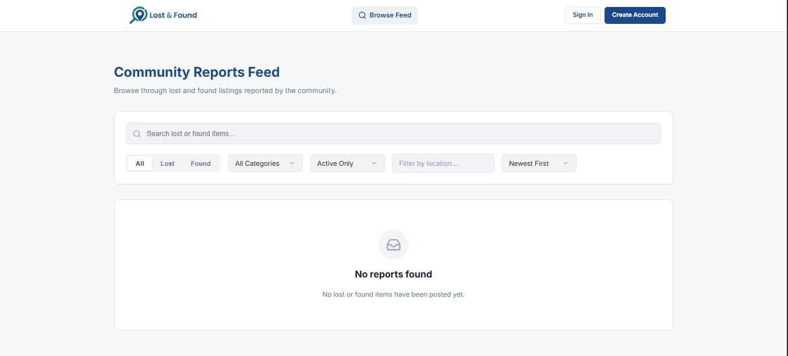
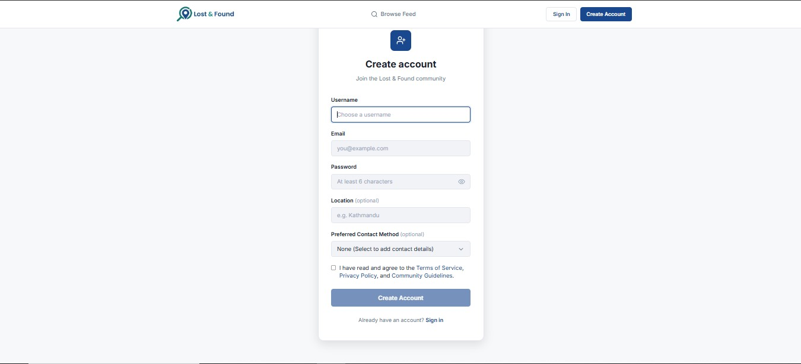
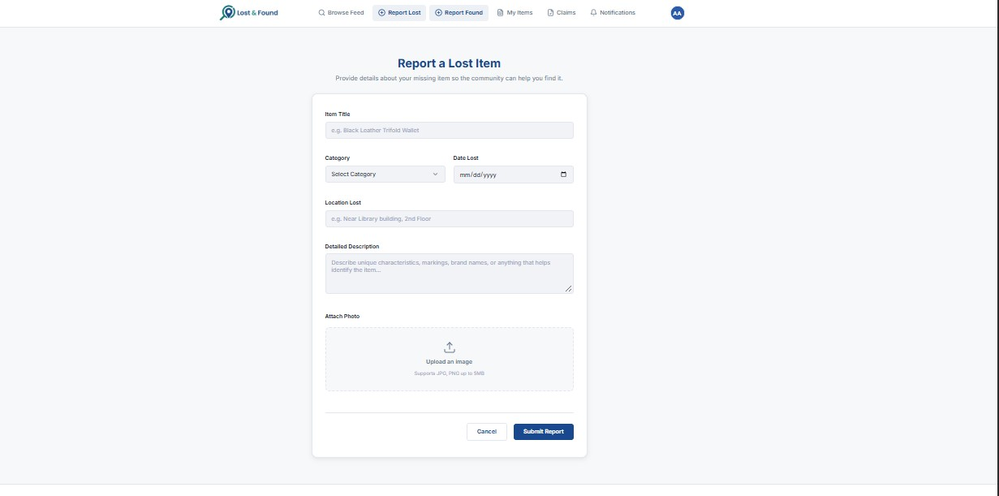

<p align="center">
  
</p>

<h1 align="center">Lost&Found</h1>
<p align="center"><i>A platform for people to seek, share, inform and retain the lost valueables in an easy and efficient manner.. </i></p>

---
<p>
<p>
<p>
  
## Current Status

This is still in building phase. The groundwork for the application is there but there's yet to add lots and lots of functionality. However, a simple general workflow is still possible with the current version. The UI/UX isn't there yet indeed but for now I'm just happy with how it works.
The login page is just a demo version for now--  
You may use demo email and password :)

---
<p>
<p>
<p>
  
## About Lost&Found

Lost&Found is a full-stack web application where-

--finders can post in news feed about random stuff they've found which may be someone else's valueable.  
--seekers can browse through the available lost items so they can retain their lost item.
--the found = lost item case is handled with furthur processes where founder and seeker can exchange their contact       information and the lost item.
--the solved cases will be removed from the news feed.

And ideally later on..
  Actual proper working user authentication where people can sign in through their google accounts will be available. I'm also planning on adding a location based notification feature(if a certain item is found on a locality then notification shall be sent to all the users from that certain locality). I need to work in making the UI more user efficient. And most importantly, IMPROVING THE SERVER HOSTING( currnetly its deployed on render so backend takes a bit time to load and home page seems to be crashed. will have to fix that later)
  
  PLEASEEEEE be a bit patient and wait for the feed to render 😭.  
  I swear it works. Just takes quite a bit time to render from render ..😉  
  [ if there's any error while loading, just reload once ]

---
<p>
<p>
<p>
  
## Current App Features

- User authentication
- Lost item reporting
- Found item reporting
- Admin dashboard (only for me😋 )
- Home news feed
- Matching system
- Notifications
- Case resolution
- Admin dashboard
- Privacy maintainance until lost = found( contact info is shared only after case matches )
- Dark/light/system theme

---
<p>
<p>
<p>
  
## Tech Stack

- React with Vite - Frontend
- Node JS with Express - Backend 
- Cloudinary - File storage (planning)
- JWT - Authentication 
- Vercel - Frontend Deployment 
- Render - Backend Deployment 

---
<p>
<p>
<p>
  
## Some Glimpses




---
<p>
<p>
<p>
  
## Getting Started


### Prerequisites
- None for now 

### Installation

```bash
# To clone the repo
git clone https://github.com/Aarjal/CourseForge.git
cd courseforge

# To install frontend dependencies
cd ../client
npm install
```

### Running locally

```bash

# To start frontend 
cd client
npm start
```

---
<p>
<p>
<p>
  
Built as part of **[Thirdspace YSWS]** with great love and effort :)

